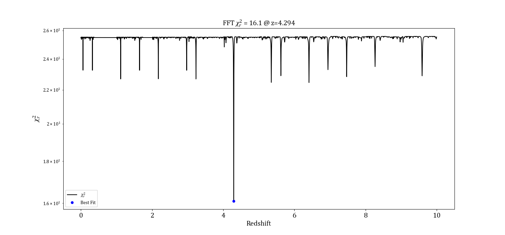
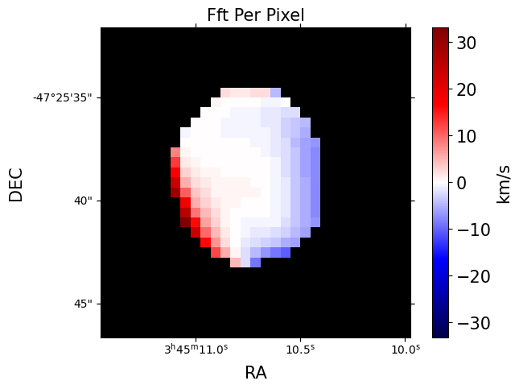

# Redshift Finding Algorithm

<h1 align="left">
  
</h1>

<h1 align="center">
  
  
  
</h1>

zfinder is primarily designed to find the redshift of high redshift radio galaxies (HzRGs, z > ~5), but can theoretically work with lower redshifts. zfinder does this via two methods: 1) The 'Template Shifting Method' (TSM) works by fitting a sum of gaussians to flux data. By iterating through small changes in dz, the offset of the gaussian series is changed and scipy.optimize is used to fit the gaussian curves to the data. For each dz, the chi-squared statistic is calculated. The minimum chi-squared corresponds to the most likely redshift of the source. 2) The 'Fourier Transform Method' (FTM) works by performing the Fast Fourier Transform algorithm on the flux data and the gaussian functions. Similarly to the TSM, the FTM iterates through small changes in dz and calculates a minimum chi-squared where the minimum corresponds to the most likely redshift.

This package was produced with ICRAR as a [summer student project](https://www.icrar.org/study-with-icrar/studentships/2022-studentship-projects/monster-black-holes-at-the-dawn-of-time/) from Nov-2022 to Feb-2023.

Installation
----------
zfinder can be installed from the terminal or command line with `pip install zfinder`

Documentation
----------
zfinder documentation can be found at [Read The Docs](https://zfinder.readthedocs.io/en/latest/)

Basic Usage
-----------

zfinder will automatically show and save plotted images and csv files for each method (configurable)

Checkout `/runs` to find example notebooks. The example `.fits` files can be downloaded from [google drive](https://drive.google.com/drive/folders/1SUbz9wjAgDrcq3tWg7qm0loz4m470G-4). 

```python
from zfinder import zfinder

fitsfile = '0856_cube_c0.4_nat_80MHz_taper3.fits'
ra = '08:56:14.8'
dec = '02:24:00.6'
aperture_radius = 3 # pixels
transition = 115.2712 # GHz

gleam_0856 = zfinder(fitsfile, ra, dec, aperture_radius, transition)
gleam_0856.template()
gleam_0856.fft()
```

Citing zfinder
----------
If you used zfinder in your paper, please be sure to cite it: (link when published)

Contributing
----------
If you have found a bug, please raise an issue. Alternatively, if you know how to fix it, you can be become a contributor by submitting a pull request.

Physical Methodology
----------

A three dimensional `.fits` data cube of right ascension (ra), declination (dec), and frequency is required to find the redshift. Given a target ra and dec, the flux at the target location is calculated across all frequencies. To find the redshift of the source, zfinder searches for emission lines of an element or molecule. Carbon Monoxide (115.2712 GHz, ~2.6mm) is a tracer of cold gas - it is theorised that Active Galactic Nuclei (AGN) at high redshifts have lots of cold gas circling around the black hole. Emission lines appear at integer multiples of the corresponding fundamental frequency, meaning for CO emission lines, they appear at 230.5424 GHz, 345.8136 GHz, etc (theoretically up to infinity). As the redshift of a source increases, the new fundamental frequency becomes equal to 1/(1+z), where z is the redshift. Gaussians at integer multiples of the fundamental frequency are overlayed onto the flux data of the source and the chi-squared is calculated by incrementing z by small changes. The minimum chi-squared corresponds to the most likely redshift of the source. At high redshifts (z > ~5), there should be two emission lines present in the flux data. The presence of two or more evenly spaced emission lines indicates a single real redshift solution; there can only be one redshift at which the gaussians will overlay all lines. Having only one line is a clear indicator of lower redshift (z < ~5) but the redshift solution is also indeterminant as there can be several redshifts where only one emission line is present.

Example Source: SPT 0345-47
----------

### Template Fitting Method
<h1 align="left">
  
  
</h1>

### FFT Fitting Method
<h1 align="left">
  
  
</h1>

### FFT Per Pixel Method
<h1 align="center">
  
  
</h1>